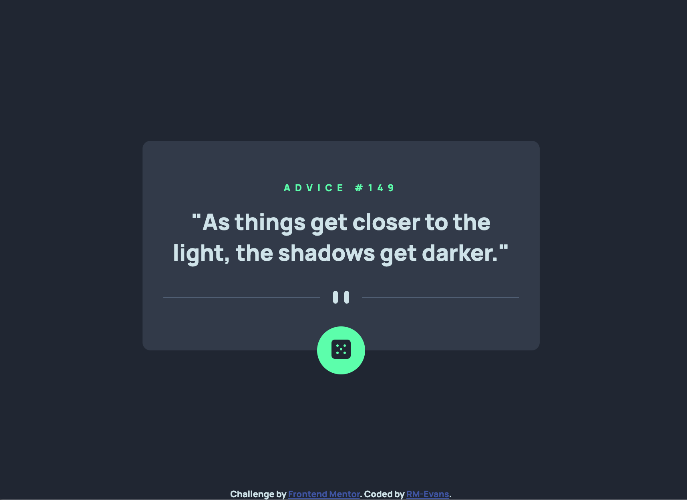

# Frontend Mentor - Advice generator app solution

This is a solution to the [Advice generator app challenge on Frontend Mentor](https://www.frontendmentor.io/challenges/advice-generator-app-QdUG-13db). Frontend Mentor challenges help you improve your coding skills by building realistic projects.

## Table of contents

- [Overview](#overview)
  - [The challenge](#the-challenge)
  - [Screenshot](#screenshot)
  - [Links](#links)
- [My process](#my-process)
  - [Built with](#built-with)
  - [Useful resources](#useful-resources)
- [Author](#author)

## Overview

### The challenge

Users should be able to:
Generate new advice at the click of a button

-

### Screenshot

### Links

- Solution URL: [Add live site URL here](https://your-live-site-url.com)
- Live Site URL: [The Live Site](https://rm-evans.github.io/advice-generator-app/)

## My process

### Built with

- Semantic HTML5 markup
- CSS
- JavaScript
- Mobile-first workflow

### Useful resources

- [Advice Cache Time](https://api.adviceslip.com/#object-slip:~:text=Note%3A%20Advice%20is%20cached%20for%202%20seconds.%20Any%20repeat%2Drequest%20within%202%20seconds%20will%20return%20the%20same%20piece%20of%20advice.) - This helped me realize that my code was working correctly even when I ran into the issue of getting the same advice consecutively.

**Note: Delete this note and replace the list above with resources that helped you during the challenge. These could come in handy for anyone viewing your solution or for yourself when you look back on this project in the future.**

## Author

- Frontend Mentor - [@RM-Evans](https://www.frontendmentor.io/profile/RM-Evans)
